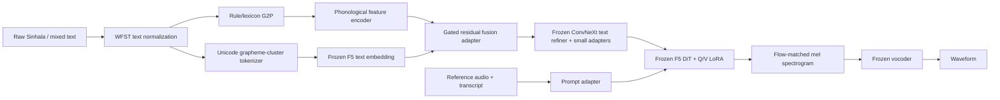

# Proposed architecture: SiFi-TTS

## Sinhala feature-informed, parameter-efficient F5-TTS

This proposal follows a review of the nine supplied papers, the existing project
proposal, and a targeted novelty search completed on 16 July 2026. The safest
claim is **novel within the reviewed Sinhala TTS literature**, not “the first in
the world.” A full systematic literature review is required before submission.

## Recommendation

Build **SiFi-TTS**, a parameter-efficient adaptation of a multilingual F5-TTS
checkpoint with a small Sinhala phonological-feature conditioning branch. Keep
the expensive acoustic backbone and vocoder frozen; train only the new Sinhala
branch, input/prompt adapters, and low-rank DiT updates.

The central research question is:

> Does explicitly conditioning a parameter-efficient flow-matching TTS model on
> Sinhala grapheme-cluster and phonological features improve pronunciation and
> naturalness over grapheme-only Sinhala F5-TTS under the same data and compute?

This is more defensible than another Tacotron, VITS, or ordinary F5-TTS model:
all three have already been applied to Sinhala.

## What the supplied papers establish

| Paper | Relevant method or finding | Consequence for this project |
|---|---|---|
| Weerasinghe et al. (2007), `978-3-540-74628-7_61.pdf` | Festival-si, 1,413 diphones, rule-based G2P and syllabification; 71.5% MRT intelligibility | Sinhala phonology and syllable structure matter, but concatenation is no longer competitive |
| Nanayakkara et al. (2018) | MaryTTS unit selection, 5,000-word lexicon and 1,000 recorded sentences; alignment and `/a/`-allophone problems; digits were untreated | Preserve linguistic rules and explicitly test alignment, allophones, and normalization |
| Sodimana et al. (2018) | WFST normalization for Sinhala and 16 semiotic classes | Reuse the grammar; normalization is a separate measurable component, not something the acoustic model should learn accidentally |
| Kjartansson et al. (2018) | Large crowdsourced Sinhala ASR corpus with noisy/mobile, multi-speaker recordings | Useful for ASR evaluation or filtered pretraining, but not automatically TTS-quality data |
| Wang et al. (2017) | Tacotron character-to-spectrogram sequence model | Historically important, but autoregressive attention is fragile and TacoSi already used this family for Sinhala |
| Arachchige & Weerasinghe (2023) | TacoSi: Tacotron-based Sinhala model, 7.5 hours, T4 training for about 160 hours; reported MOS 4.39 and 84% intelligibility | Must reproduce evaluation carefully; do not present Tacotron as new |
| Kim et al. (2021) | VITS: variational latent model, normalizing flows, adversarial waveform decoder, stochastic duration | Strong baseline, but Sinhala VITS systems and a recent publication already exist |
| Senarath (2024), `2020MCS086.pdf` | Sinhala VAENAR experiment on PathNirvana required heavy compute and ultimately did not generate clear speech | Training a complex generative model from scratch is too risky for this module |
| Kwon et al. (2025) | Conditioning Adapter, Prompt Adapter, DiT LoRA and DropPath adapted F5-TTS using 1.72% trainable parameters, 12.65 hours, one Titan RTX | Best compute strategy, but PEFT alone is not a Sinhala-specific architectural contribution |

The supplied `2410.06885v3.pdf` adds the F5-TTS backbone and inference-only Sway
Sampling. Existing public Sinhala F5-TTS checkpoints mean that simply applying
F5-TTS or Sway Sampling is an experiment, not sufficient architectural novelty.

## Architecture



### 1. Deterministic Sinhala frontend

Normalize Unicode to NFC and segment extended grapheme clusters rather than raw
code points. Apply the open Sinhala WFST rules for cardinal numbers, dates,
times, currency, measurements, abbreviations, telephone numbers, URLs, and
verbatim symbols. Preserve a raw-text path for the normalization ablation.

Generate a pronunciation sequence from the existing Sinhala G2P resources. Each
pronunciation token also receives a compact feature vector:

- consonant place and manner;
- voicing, aspiration and prenasalization;
- vowel identity and length;
- independent/dependent vowel status;
- syllable boundary and word boundary;
- explicit flags for code-switching, unknown pronunciation, and punctuation.

This representation targets recurring Sinhala errors identified in the papers:
aspiration, vowel/allophone distinction, unseen words, and symbols/numerals.

### 2. Sinhala feature-informed fusion adapter

Let `h_g` be the frozen F5 text representation and `h_p` the output of a small
phonological encoder. Align phonological features to grapheme clusters with the
deterministic G2P trace and fuse them through:

```text
gate = sigmoid(Wg [h_g ; h_p])
h_fused = h_g + gate * Wp(h_p)
```

Initialize `Wp` at zero so the model starts exactly as the pretrained checkpoint.
Use a 2–4 layer depthwise-separable ConvNeXt-style encoder, hidden size 128–256,
kernel sizes 3/5, and dropout 0.1. This branch should remain below roughly two
million parameters.

Unlike phoneme-only input, gated residual fusion retains orthographic information
for punctuation, morphology, and Sinhala/English code-switching. Unlike a plain
grapheme model, it makes acoustically relevant distinctions explicit.

### 3. Parameter-efficient acoustic adaptation

Freeze the F5-TTS backbone initially. Train:

- the feature encoder and gated fusion adapter;
- small conditioning adapters in the ConvNeXt text refiner;
- the prompt input projection adapter;
- LoRA on DiT query and value projections only (`rank=8` first, then `16` if
  justified);
- no vocoder parameters in the main experiment.

Use the standard conditional flow-matching loss. Avoid adding an unvalidated
auxiliary loss in version 1; the clean ablation is more publishable than a large
collection of interacting ideas. Sway Sampling (`s=-1`) remains an inference
factor and must not be confused with the architecture's training contribution.

## Required ablations

Use identical data splits, prompts, seeds, training steps, and evaluation text.

| ID | Text representation | Trainable adaptation | Purpose |
|---|---|---|---|
| B0 | Grapheme | Existing public Sinhala F5 checkpoint | External baseline |
| B1 | Grapheme | Standard LoRA/adapters | Tests whether PEFT alone helps |
| B2 | Phoneme only | Same PEFT budget | Tests conventional phonemization |
| S1 | Grapheme + phonological-feature gated fusion | Same PEFT budget | Proposed SiFi-TTS |
| S2 | S1 without WFST normalization | Same | Isolates normalization benefit |
| S3 | S1, Sway off/on at 16 NFE | None at inference | Isolates Sway Sampling benefit |

Match the trainable parameter count of B1, B2 and S1 as closely as possible. If
S1 has more capacity, add a parameter-matched B1; otherwise a reviewer can argue
that improvement came only from extra parameters.

## Data plan

Start with the clean PathNirvana male subset. Use speaker-disjoint or at minimum
sentence-disjoint validation/test partitions and remove duplicates before
splitting. Do not combine noisy SLR52 audio into the first acoustic experiment.

After the clean experiment works, add only filtered multi-speaker data. Filtering
should include transcript agreement from Sinhala ASR, clipping/SNR checks,
duration limits, and manual listening to a random sample. Record the data license
and provenance for every clip.

Construct a 100–200 sentence challenge set balanced across ordinary prose,
aspiration/prenasalization, vowel length/allophones, rare conjuncts, numerals and
dates, code-switching, unseen words, and long/repetitive text. Keep it completely
outside training.

## Training plan under the resource limit

### Local 6 GB GPUs

Use them for preprocessing, G2P/normalization tests, short pipeline smoke tests,
inference, ASR transcription, and parallel metric computation. Three separate
6 GB cards do not behave like one 18 GB card unless they are in a suitable
distributed machine; ordinary home/networked machines should run independent
jobs instead.

A 335M F5 model may still exceed 6 GB during PEFT because frozen weights are not
the only memory cost—activations dominate. Try BF16/FP16, batch-by-frame limits,
gradient accumulation, gradient checkpointing, 8-bit optimizer states, cached
mel features, and sequence-length buckets. Treat a successful local run as a
bonus, not the critical path.

### Cloud 24 GB GPU

Use one RTX 3090/4090-class 24 GB instance for actual adaptation:

1. Run a 200–500 step overfit test on 20 clips.
2. Run B1 and S1 for a short equal-step pilot; stop poor configurations early.
3. Train the winning settings with three seeds only after the pipeline is fixed.
4. Save adapter-only checkpoints frequently and terminate the instance when idle.

At marketplace prices observed in July 2026, a 4090 was commonly listed around
USD 0.34–0.74/hour, although availability and storage charges vary. A total team
budget of LKR 15,000 should therefore be reserved as a capped pilot budget, not
spent on a single long run. Verify the live console price before deployment.

## Evaluation and success criteria

Primary metrics:

- Sinhala CER from one fixed ASR system, overall and by challenge category;
- blinded native-speaker naturalness MOS and intelligibility/transcription score;
- paired preference between B1 and S1;
- real-time factor and peak VRAM.

Secondary metrics are WER, speaker-embedding similarity, and failure rate. Report
95% confidence intervals and paired bootstrap tests. Use at least 15 native
listeners, randomize sample order, hide system names, include natural recordings
and the public Sinhala VITS/F5 baselines, and never select only the best seed.

The architecture succeeds scientifically if S1 significantly improves the
parameter-matched grapheme PEFT baseline on pronunciation-sensitive categories
without a meaningful naturalness or speed regression. It does not need to beat
every baseline on every metric to produce a useful paper.

## Novelty statement suitable for the proposal

> Prior Sinhala TTS work reviewed here uses diphone/unit selection, Tacotron,
> VAENAR, VITS, or direct grapheme-based F5-TTS. We propose a compute-efficient
> Sinhala feature-informed F5-TTS adaptation that fuses grapheme-cluster
> representations with explicit phonological features through gated residual
> adapters while updating only a small fraction of the acoustic model. Controlled
> parameter-matched ablations will test whether Sinhala linguistic conditioning,
> rather than model size, improves intelligibility and naturalness.

Do not write “the first” until a systematic search across IEEE Xplore, ACM,
Scopus, Google Scholar, arXiv, ISCA, local university repositories, Hugging Face,
and GitHub has been documented.

## References reviewed

1. Weerasinghe et al., *Festival-si: A Sinhala Text-to-Speech System*, 2007.
2. Kjartansson et al., *Crowd-Sourced Speech Corpora for Javanese, Sundanese,
   Sinhala, Nepali, and Bangladeshi Bengali*, SLTU 2018.
3. Nanayakkara et al., *A Human Quality Text to Speech System for Sinhala*, SLTU
   2018.
4. Sodimana et al., *Text Normalization for Bangla, Khmer, Nepali, Javanese,
   Sinhala and Sundanese Text-to-Speech Systems*, SLTU 2018.
5. Wang et al., *Tacotron: Towards End-to-End Speech Synthesis*, Interspeech 2017.
6. Kim et al., *Conditional Variational Autoencoder with Adversarial Learning for
   End-to-End Text-to-Speech (VITS)*, ICML 2021.
7. Arachchige and Weerasinghe, *TacoSi: A Sinhala Text to Speech System with
   Neural Networks*, 2023.
8. Senarath, *Enhancing Sinhala Text-to-Speech System Using Deep Learning
   Techniques*, MCS dissertation, 2024.
9. Kwon et al., *Parameter-Efficient Fine-Tuning for Low-Resource Text-to-Speech
   via Cross-Lingual Continual Learning*, Interspeech 2025.
10. Chen et al., *F5-TTS: A Fairytaler that Fakes Fluent and Faithful Speech with
    Flow Matching*, 2024.
