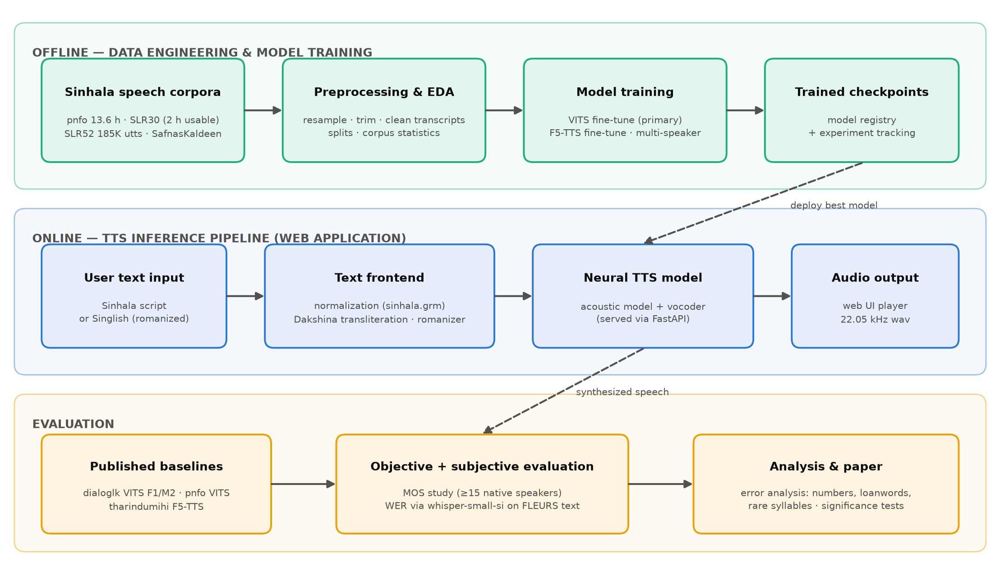

*In22-S5-CS3501 Data Science and Engineering Project*
*Department of Computer Science and Engineering*
*University of Moratuwa*

# A Neural Text-to-Speech Application for Sinhala

## Building, fine-tuning and systematically evaluating open Sinhala speech synthesis

**Team Members:**

- _Member 1 — name & index no._
- _Member 2 — name & index no._
- _Member 3 — name & index no._

***Group ID: 18***
***Project ID: 12***
***Mentor: Dr. Buddhika (buddhika@cse.mrt.ac.lk)***
***Teaching Assistant: ….***

# 1. Executive Summary:

We will build a working neural Text-to-Speech (TTS) application that converts written Sinhala text into natural-sounding speech. Although Sinhala is spoken by about 17 million people, it has been left out of major industry TTS efforts — our preliminary study (July 2026) verified that Meta's MMS-TTS project covers 1,100+ languages but has **no Sinhala TTS model**, and that large multilingual speech corpora (Common Voice, CMU Wilderness, OpenBibleTTS) contain no usable Sinhala. We will train and fine-tune modern neural TTS architectures (VITS and F5-TTS) on the best openly licensed Sinhala corpora — which we have already downloaded and measured (≈30 hours across four corpora, led by the 13.6-hour PathNirvana studio corpus) — behind a text frontend that handles Sinhala-specific normalization (numbers, dates, loanwords) and optional romanized ("Singlish") input. The system will be delivered as a web application and evaluated with both native-speaker Mean Opinion Score (MOS) studies and automatic intelligibility metrics (Whisper-based WER), compared against the three community baselines we verified to exist. Expected outcomes match the project brief: a working Sinhala TTS application (primary) and a research publication (secondary).

# 2. Problem Statement:

Speech interfaces — screen readers, public announcements, voice assistants, audiobook narration, and accessibility tools — depend on high-quality TTS. For Sinhala, this technology gap directly affects millions of users: visually-impaired Sinhala speakers lack natural-sounding screen readers, and local products must fall back to English voices or robotic legacy unit-selection systems.

Our verified preliminary findings sharpen the problem:

1. **No industry baseline exists.** `facebook/mms-tts-sin` does not exist — Meta's MMS supports Sinhala for speech *recognition* only. Google published Sinhala TTS research in 2018 but no usable modern model.
2. **The available data is scattered and poorly documented.** Dataset cards are unreliable — e.g., OpenSLR SLR30 advertises a multi-speaker TTS corpus, but only 1,251 of its 2,064 clips (~2 h) have transcripts, which we found only by downloading and measuring it.
3. **Existing community models are unevaluated.** The Dialog/UoM VITS voices and one F5-TTS fine-tune exist as checkpoints with no published quality evaluation, so nobody knows how good Sinhala TTS currently is or where it fails (numbers, English loanwords, rare Sanskrit/Pali-origin syllables).

This project addresses all three: a documented data foundation, better models, and the first systematic evaluation of Sinhala TTS.

# 3. Data Description:

All corpora below are publicly available, and we have already downloaded and verified them hands-on (statistics measured with our own tooling, available in the group repository).

| Corpus | Source | Measured contents | Type / format | License | Role |
|---|---|---|---|---|---|
| **PathNirvana (pnfo)** | [github.com/pnfo/sinhala-tts-dataset](https://github.com/pnfo/sinhala-tts-dataset/releases) | 6,386 clips, **13.61 h**, 22.05 kHz studio quality; male speaker 11.58 h, female 2.03 h; transcripts in both Sinhala script and romanized form | Audio (wav) + LJSpeech-style metadata | GPL-3.0 (+ non-offensive-use clause) | Primary training corpus |
| **OpenSLR SLR30** | [openslr.org/30](https://www.openslr.org/30/) | 2,064 clips, 12 speakers, 3.38 h, 48 kHz — **only 1,251 clips (~2 h) transcribed** | Audio (wav) + transcript lines | CC BY-SA 4.0 | Multi-speaker experiments |
| **OpenSLR SLR52** | [openslr.org/52](https://www.openslr.org/52/) | ~185,000 crowdsourced utterances, 16 kHz, many speakers (ASR quality) | Audio + TSV transcripts | CC BY-SA 4.0 | Pre-training; ASR fine-tuning for evaluation |
| **SafnasKaldeen** | [Kaggle](https://www.kaggle.com/datasets/safnask/sinhalatts-dataset-publication-by-voicemakers) | 4 native speakers, phonetically balanced sentences (UoM FYP 2025) | Audio + transcripts | Apache-2.0 | Speaker-variety fine-tuning |
| **FLEURS (si_lk)** | [HF: google/fleurs](https://huggingface.co/datasets/google/fleurs) | ~10 h read speech, standard train/dev/test splits | Audio + transcripts | CC BY 4.0 | **Held-out evaluation only** |

Supporting text/linguistic data: Google's `language-resources/si` (text-normalization grammar `sinhala.grm`, pronunciation dictionaries, IPA mappings) and the Dakshina romanization lexicon for Singlish input. We also documented dead ends so no effort is wasted: Common Voice Sinhala has only 59 unvalidated clips, and CMU Wilderness/OpenBibleTTS contain no Sinhala.

# 4. Methods:

Our approach has three connected pipelines — offline data engineering & training, an online inference application, and an evaluation loop — shown in the system-level view below.

**Data engineering & EDA.** A unified preprocessing pipeline (resampling, loudness normalization, silence trimming, transcript cleaning, deterministic train/val/test splits) feeds all experiments. Exploratory analysis covers audio-quality and duration distributions, speaker/phonetic coverage, and text statistics (rare syllables, loanword and numeral frequency) to guide both training and error analysis.

**Text frontend (NLP).** We adapt Google's open Sinhala normalization grammar to expand numbers, dates, currency and abbreviations into words, handle English loanwords, and optionally transliterate romanized Singlish input via Dakshina. This is the component most responsible for real-world quality and is largely missing from existing community models.

**Modeling (ML).** We fine-tune two modern neural TTS architectures: (a) **VITS** — an end-to-end variational model with adversarial training, initialised from available Sinhala checkpoints and trained on the pnfo male voice; and (b) **F5-TTS** — a recent flow-matching architecture — for comparison. A multi-speaker VITS variant on SLR30 + SafnasKaldeen is a stretch experiment. Training uses experiment tracking, fixed splits and seeded runs for reproducibility.

**Application (deployment).** The best model is served through a FastAPI inference API with a lightweight web UI (text box → audio player), containerized and deployed as a public demo (e.g., Hugging Face Spaces).

# 5. Evaluation Plan

**System-level:** (1) **MOS study** — ≥15 native Sinhala speakers rate naturalness and intelligibility of our system, the three verified baselines (Dialog/UoM VITS F1/M2, PathNirvana VITS, tharindumihi F5-TTS), and hidden natural-speech anchors, on a balanced sentence set; results reported with confidence intervals and significance tests. (2) **Automatic intelligibility** — transcribe synthesized speech with a fine-tuned Sinhala Whisper model (`seniruk/whisper-small-si`) and compute WER/CER against the input text on held-out FLEURS sentences.

**Component-level:** text frontend evaluated on a labelled normalization test set (numbers, dates, currency, loanwords — accuracy per category); acoustic model monitored via validation loss and mel-cepstral distortion during training; vocoder/inference measured for real-time factor and API latency; robustness tested on edge cases (very long sentences, mixed Sinhala-English, digits).

**Error analysis:** stratified listening tests on the categories our EDA flags as hard (rare Sanskrit/Pali syllables, loanwords, numerals) to identify *where* models fail, not just aggregate scores.

# 6. Expected Outcomes and Success Criteria:

**Outcomes:** (1) a working, publicly deployed Sinhala TTS web application; (2) fine-tuned Sinhala TTS models with reproducible training/evaluation code in a public repository; (3) a documented, verified data foundation for Sinhala TTS; (4) the first systematic evaluation of all available Sinhala TTS systems; (5) a paper draft targeting ICTer/MERCon or a low-resource speech workshop.

**Success criteria:** the application synthesizes arbitrary Sinhala text end-to-end in near-real time (RTF < 1 on GPU, API latency < 2 s for a typical sentence); our best model **matches or exceeds every existing baseline** on MOS with statistical significance; WER of synthesized speech is within a defined margin of natural-speech WER; the normalization module reaches ≥95% accuracy on its test set; and the full pipeline is reproducible from the repository by a third party.

# 7. Division of work (individual responsibilities)

Work is divided by **phase, not by role** — this is a data science project, so every member does data engineering, EDA, modeling and evaluation on a parallel slice of similar weight; software-engineering tasks are secondary duties spread across all three. Slices may be swapped by agreement; each member must be able to defend a complete data-science workflow.

## Team member 1:

* Preprocessing pipeline and corpus statistics for the pnfo corpus (primary training set)
* EDA: audio-quality and clip-duration distribution analysis across corpora
* VITS fine-tuning on the pnfo male voice (primary model)
* Automatic evaluation harness: Whisper-WER scoring of synthesized speech
* Application: inference API backend (secondary duty)
* Paper: data and experimental-setup sections

## Team member 2:

* Preprocessing for SLR30 (transcript matching) and SafnasKaldeen; multi-speaker data preparation
* EDA: speaker, gender and phonetic-coverage analysis
* F5-TTS fine-tuning and VITS-vs-F5 comparison
* MOS study: design, rater recruitment, execution and statistical analysis
* Application: model serving and frontend–model integration (secondary duty)
* Paper: modeling and results sections

## Team member 3:

* SLR52 large-scale filtering; FLEURS evaluation set preparation; normalization test-set construction
* EDA: text statistics — rare syllables, loanwords, numeral frequency
* Multi-speaker VITS experiments and reproduction of the three published baselines
* Error analysis by category and significance testing
* Application: web UI and demo deployment (secondary duty)
* Paper: evaluation, error-analysis and related-work sections

# 8. Preliminary Bibliography:

1. K. Sodimana et al., "A Step-by-Step Process for Building TTS Voices Using Open Source Data and Frameworks for Bangla, Javanese, Khmer, Nepali, Sinhala, and Sundanese," *SLTU*, 2018.
2. K. Sodimana et al., "Text Normalization for Bangla, Khmer, Nepali, Javanese, Sinhala and Sundanese Text-to-Speech Systems," *SLTU*, 2018.
3. J. Kim, J. Kong, J. Son, "Conditional Variational Autoencoder with Adversarial Learning for End-to-End Text-to-Speech (VITS)," *ICML*, 2021.
4. Y. Chen et al., "F5-TTS: A Fairytaler that Fakes Fluent and Faithful Speech with Flow Matching," 2024.
5. V. Pratap et al., "Scaling Speech Technology to 1,000+ Languages (MMS)," *JMLR*, 2024.
6. A. Radford et al., "Robust Speech Recognition via Large-Scale Weak Supervision (Whisper)," *ICML*, 2023.
7. B. Roark et al., "Processing South Asian Languages Written in the Latin Script: the Dakshina Dataset," *LREC*, 2020.
8. PathNirvana Sinhala TTS dataset — github.com/pnfo/sinhala-tts-dataset; OpenSLR SLR30/SLR52 — openslr.org; Google language-resources — github.com/google/language-resources (all verified July 2026; measured statistics in the group's `Data_explore` repository: github.com/DSEgrp18/Data_explore).
